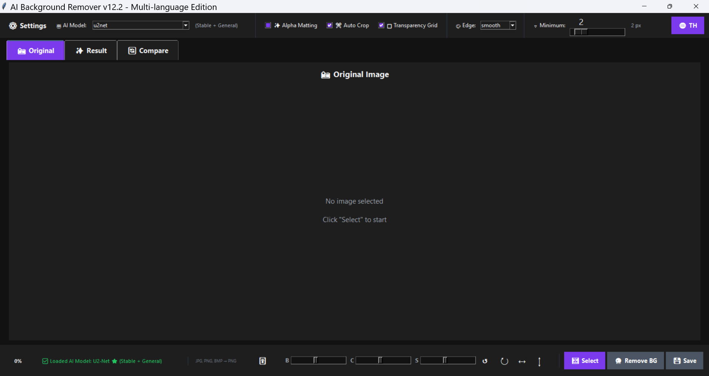
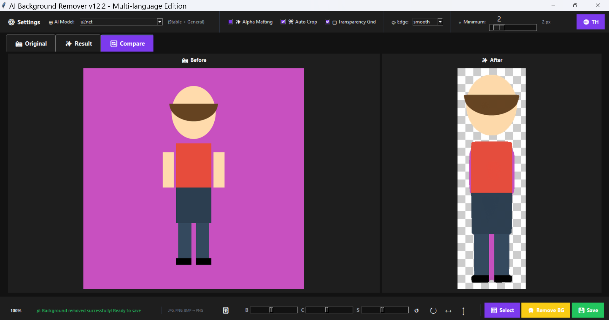

# 🎨 AI Background Remover v12.2

**Remove image backgrounds automatically using AI - Multi-language Edition (EN/TH)**

[Features](#-features) •
[Screenshots](#-screenshots) •
[Installation](#-installation) •
[Usage](#-usage) •
[Documentation](#-documentation) •
[Contributing](#-contributing)

---

## ✨ Features

<table>
<tr>
<td width="50%">

### 🤖 AI Technology
- **6 AI Models** - U2-Net, IS-Net, Silueta
- **Advanced Models** - DIS, BiRefNet (optional)
- **Auto Fallback** - Smart model switching
- **Local Models** - Offline support

### 🎨 Image Processing
- **Alpha Matting** - Detailed edge processing
- **Auto Crop** - Trim transparency
- **Edge Modes** - Smooth/Sharp/None
- **Minimum Filter** - Edge refinement (0-20px)

</td>
<td width="50%">

### 🌐 User Interface
- **Multi-language** - English & Thai (🇬🇧/🇹🇭)
- **Modern UI** - Clean, intuitive design
- **Dark Theme** - Eye-friendly interface
- **Real-time Preview** - Before/After comparison

### 🛠️ Tools & Controls
- **Image Adjustments** - Brightness/Contrast/Saturation
- **Transform Tools** - Rotate, Flip, Zoom
- **Transparency Grid** - Visual transparency check
- **Circular Progress** - Modern progress indicator

</td>
</tr>
</table>

---

## 📸 Screenshots

### Main Interface
<div align="center">


*Clean, modern interface with all controls accessible*
</div>

### Before & After Comparison
<div align="center">


*Side-by-side comparison view*
</div>

### Multi-language Support
<div align="center">
<table>
<tr>
<td width="50%"><br/><b>English Interface</b></td>
<td width="50%"><br/><b>ภาษาไทย Interface</b></td>
</tr>
</table>
</div>

### Settings & Controls
<div align="center">


*Comprehensive settings and adjustment controls*
</div>

---

## 🚀 Quick Start

### Installation

```bash
# 1. Clone repository
git clone https://github.com/YOUR_USERNAME/ai-background-remover.git
cd ai-background-remover

# 2. Create virtual environment (recommended)
python -m venv venv

# Activate virtual environment
# Windows:
venv\Scripts\activate
# macOS/Linux:
source venv/bin/activate

# 3. Install dependencies
pip install -r requirements.txt

# 4. Run program
python main.py
```

### First Run

1. **Select Image** - Click **🖼 Select** button
2. **Choose AI Model** - Default: U2-Net (recommended)
3. **Remove Background** - Click **🔮 Remove BG**
4. **Adjust Settings** (optional):
   - Minimum Filter: 0-2 px
   - Edge Mode: Smooth
   - Alpha Matting: OFF (for speed)
5. **Save Result** - Click **💾 Save**
6. **Switch Language** - Click **🌐** button (top-right)

---

## 📋 Requirements

### System Requirements
- **OS**: Windows 10/11, macOS 10.13+, or Linux
- **RAM**: 4 GB minimum, 8 GB recommended
- **Storage**: 1 GB free space (for models)
- **Python**: 3.8 or higher

### Dependencies

| Package | Version | Purpose |
|---------|---------|---------|
| rembg | ≥2.0.50 | Background removal |
| Pillow | ≥10.0.0 | Image processing |
| numpy | ≥1.24.0 | Numerical operations |
| scipy | ≥1.11.0 | Scientific computing |
| onnxruntime | ≥1.16.0 | AI model inference |

```bash
pip install -r requirements.txt
```

---

## 🎯 AI Models

### Available Models

| Model | Speed | Quality | Stability | Size | Use Case |
|-------|-------|---------|-----------|------|----------|
| **U2-Net** ⭐ | ⚡⚡⚡⚡ | ⭐⭐⭐⭐ | ⭐⭐⭐⭐⭐ | 176 MB | General (Recommended) |
| **IS-Net General** | ⚡⚡⚡⚡ | ⭐⭐⭐⭐⭐ | ⭐⭐⭐⭐ | 172 MB | High quality |
| **Silueta** | ⚡⚡⚡⚡⚡ | ⭐⭐⭐ | ⭐⭐⭐ | 43 MB | Speed priority |
| U2-Net Portrait | ⚡⚡⚡⚡ | ⭐⭐⭐⭐ | ⭐⭐⭐⭐⭐ | 4.7 MB | Portraits/Faces |
| U2-Net Human | ⚡⚡⚡⚡ | ⭐⭐⭐⭐ | ⭐⭐⭐⭐⭐ | 176 MB | Full body |
| IS-Net Anime | ⚡⚡⚡⚡ | ⭐⭐⭐⭐⭐ | ⭐⭐⭐⭐ | 172 MB | Anime/Cartoon |

### Advanced Models (Optional)

Require `rembg>=2.0.50` and additional setup:

- **DIS General** - Excellent quality, stable
- **DIS Anime** - Best for anime/cartoon
- **BiRefNet Lite** - Fast with high quality
- **BiRefNet Portrait** - HD quality portraits

See [Advanced Models Guide](docs/en/advanced_models_guide_en.md) for setup instructions.

---

## 🔧 Configuration

### Default Settings

Edit `config.py` to customize:

```python
# ==================== Language Configuration ====================
DEFAULT_LANGUAGE = 'en'  # 'en' = English, 'th' = Thai

# ==================== AI Models Configuration ====================
AI_MODELS = {
    "u2net": "U2-Net ⭐ (Stable + General)",
    "u2netp": "U2-Net Portrait (Face)",
    "u2net_human_seg": "U2-Net Human (Full Body)",
    "silueta": "Silueta (Very Fast)",
    "isnet-general-use": "IS-Net General ⭐ (High Quality)",
    "isnet-anime": "IS-Net Anime (Anime)",
}

# ==================== Processing Settings ====================
MINIMUM_FILTER_RANGE = {
    'min': 0,
    'max': 20,
    'default': 0
}

AUTO_CROP_PADDING = 20  # pixels
```

### Recommended Settings by Use Case

#### General Photos
```python
Model: U2-Net
Alpha Matting: OFF
Minimum Filter: 0-1 px
Edge Mode: Smooth
Auto Crop: ON
```

#### Portraits/Faces
```python
Model: U2-Net Portrait
Alpha Matting: ON
Minimum Filter: 0 px
Edge Mode: Smooth
Auto Crop: ON
```

#### Anime/Cartoon
```python
Model: IS-Net Anime
Alpha Matting: OFF
Minimum Filter: 1-2 px
Edge Mode: Sharp
Auto Crop: ON
```

#### Product Photos
```python
Model: IS-Net General
Alpha Matting: ON
Minimum Filter: 0 px
Edge Mode: None
Auto Crop: ON
```

---

## 📚 Documentation

### English 🇬🇧
- [**Advanced Models Guide**](docs/en/advanced_models_guide_en.md) - Setup DIS, BiRefNet models
- [**Local Models Guide**](docs/en/local_models_guide_en.md) - Offline model configuration
- [**Multi-language Guide**](docs/en/multilang_guide_en.md) - Language system documentation
- [**Portable Setup Guide**](docs/en/portable_guide_en.md) - Create standalone executable

### Thai 🇹🇭
- [**คู่มือ Advanced Models**](docs/th/advanced_models_guide.md) - การตั้งค่า DIS, BiRefNet
- [**คู่มือ Local Models**](docs/th/local_models_guide.md) - การใช้งาน models แบบออฟไลน์
- [**คู่มือระบบหลายภาษา**](docs/th/multilang_guide.md) - เอกสารระบบภาษา
- [**คู่มือ Portable**](docs/th/portable_guide.md) - สร้างไฟล์ .exe

---

## 🎒 Portable Version

Create standalone executable with PyInstaller:

### Build Executable

```bash
# Install PyInstaller
pip install pyinstaller

# Build using spec file
pyinstaller main.spec

# Output: dist/main/
```

### Features
- ✅ No Python installation required
- ✅ Include models in package
- ✅ Works offline
- ✅ Single folder distribution
- ✅ ~1 GB total size

See [Portable Guide](docs/en/portable_guide_en.md) for detailed instructions.

---

## 💡 Usage Tips

### Getting Best Results

1. **Choose Right Model**
   - General photos → U2-Net
   - Portraits → U2-Net Portrait
   - Anime → IS-Net Anime
   - High quality → IS-Net General

2. **Adjust Settings**
   - Clean edges → Minimum Filter 0-1 px
   - Complex hair → Alpha Matting ON
   - Simple objects → Alpha Matting OFF
   - Smooth edges → Edge Mode: Smooth

3. **Image Adjustments**
   - Brightness: 0.8-1.2
   - Contrast: 0.9-1.1
   - Saturation: 0.8-1.2

4. **Performance Tips**
   - Use Silueta for speed
   - Disable Alpha Matting for faster processing
   - Close other programs for better performance
   - Use local models folder for offline work

---

## 🐛 Troubleshooting

### Common Issues

#### "No session class found for model"
**Cause**: Old rembg version  
**Solution**: 
```bash
pip install --upgrade rembg
```

#### Model downloads slowly
**Cause**: First-time download  
**Solution**: Wait for download to complete (~180 MB). Models are cached after first use.

#### Program won't start
**Cause**: Missing dependencies  
**Solution**:
```bash
pip install -r requirements.txt --force-reinstall
```

#### Out of memory error
**Cause**: Large image or insufficient RAM  
**Solution**: 
- Resize image before processing
- Close other programs
- Use Silueta model (smaller memory footprint)

#### Antivirus blocking (Portable version)
**Cause**: False positive from PyInstaller  
**Solution**: Add to whitelist or build with `--noupx` flag

### Getting Help

1. Check [Documentation](docs/en/)
2. Search [Issues](https://github.com/YOUR_USERNAME/ai-background-remover/issues)
3. Create [New Issue](https://github.com/YOUR_USERNAME/ai-background-remover/issues/new)
4. Join [Discussions](https://github.com/YOUR_USERNAME/ai-background-remover/discussions)

---

## 🤝 Contributing

Contributions are welcome! Here's how you can help:

### Ways to Contribute

- 🐛 **Report Bugs** - Open an issue with details
- 💡 **Suggest Features** - Share your ideas
- 📝 **Improve Documentation** - Fix typos, add examples
- 🌍 **Add Translations** - New languages welcome
- 🔧 **Submit Code** - Bug fixes, new features

### Development Setup

```bash
# 1. Fork repository
# 2. Clone your fork
git clone https://github.com/YOUR_USERNAME/ai-background-remover.git
cd ai-background-remover

# 3. Create branch
git checkout -b feature/amazing-feature

# 4. Make changes
# 5. Test thoroughly

# 6. Commit
git commit -m "Add amazing feature"

# 7. Push
git push origin feature/amazing-feature

# 8. Create Pull Request
```

### Code Style

- Follow PEP 8 for Python code
- Add docstrings for functions
- Comment complex logic
- Update documentation
- Test on multiple platforms

See [CONTRIBUTING.md](CONTRIBUTING.md) for detailed guidelines.

---

## 📝 License

This project is licensed under the MIT License - see the [LICENSE](LICENSE) file for details.

### MIT License Summary

- ✅ Commercial use
- ✅ Modification
- ✅ Distribution
- ✅ Private use
- ⚠️ Liability
- ⚠️ Warranty

---

## 🙏 Acknowledgments

### Open Source Projects

- [**rembg**](https://github.com/danielgatis/rembg) - Background removal library by Daniel Gatis
- [**U2-Net**](https://github.com/xuebinqin/U-2-Net) - Deep learning model by Xuebin Qin
- [**IS-Net**](https://github.com/xuebinqin/DIS) - Dichotomous Image Segmentation
- [**Pillow**](https://python-pillow.org/) - Python Imaging Library
- [**NumPy**](https://numpy.org/) - Scientific computing
- [**ONNX Runtime**](https://onnxruntime.ai/) - Model inference

### Inspiration

- Adobe Photoshop - Remove Background tool
- Remove.bg - Online background removal
- Background Eraser apps - Mobile applications

---

## 📊 Project Stats

<div align="center">


</div>

---

## 🗺️ Roadmap

### Version 12.3 (Planned)
- [ ] Batch processing for multiple images
- [ ] Custom background colors/images
- [ ] History/Undo functionality
- [ ] Preset configurations
- [ ] Command-line interface

### Version 13.0 (Future)
- [ ] Advanced hair/fur detection
- [ ] Smart object selection
- [ ] Background blur effects
- [ ] Cloud processing option
- [ ] Plugin system for extensions
- [ ] More languages (Chinese, Japanese, Korean)

See [CHANGELOG.md](CHANGELOG.md) for version history.

---

## 📧 Contact & Support

### Get in Touch

- **GitHub Issues**: [Report bugs or request features](https://github.com/YOUR_USERNAME/ai-background-remover/issues)
- **GitHub Discussions**: [Ask questions or share ideas](https://github.com/YOUR_USERNAME/ai-background-remover/discussions)
- **Email**: your.email@example.com
- **Website**: https://your-website.com

### Support the Project

If you find this project useful:

- ⭐ **Star the repository** - Show your support
- 🐛 **Report bugs** - Help improve the project
- 💡 **Suggest features** - Share your ideas
- 📝 **Improve documentation** - Help others
- 🔀 **Submit pull requests** - Contribute code
- ☕ **Buy me a coffee** - [Support link]

---

## 📜 Changelog

### [12.2] - 2024-12-XX

#### Added ✨
- Multi-language support (EN/TH)
- Circular progress bar
- Image adjustment controls (Brightness/Contrast/Saturation)
- Edge processing modes (Smooth/Sharp/None)
- Local models folder support
- Complete bilingual documentation

#### Improved 🔧
- Model management with auto-fallback
- UI/UX design and organization
- Status messages and error handling
- Performance optimization

#### Fixed 🐛
- Model switching issues
- Minimum filter application
- Transparency grid updates
- Zoom level resets

See [CHANGELOG.md](CHANGELOG.md) for complete version history.

---

## ⭐ Star History

<div align="center">

[](https://star-history.com/#YOUR_USERNAME/ai-background-remover&Date)

*If you find this project useful, please consider giving it a star ⭐*

</div>

---

## 📱 Stay Updated

- 🌟 **Star** this repository to stay updated
- 👁️ **Watch** for new releases
- 🍴 **Fork** to experiment with your own version

---

<div align="center">

**Made with ❤️ by [dhammawatthumpra-coder]**

**© 2024 AI Background Remover v12.2**

[⬆ Back to Top](#-ai-background-remover-v122)

</div>
