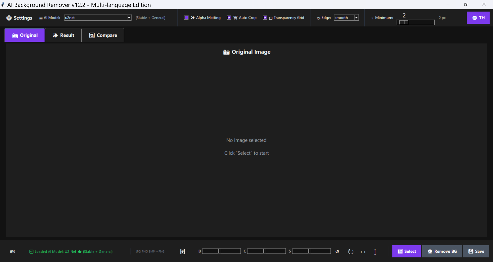
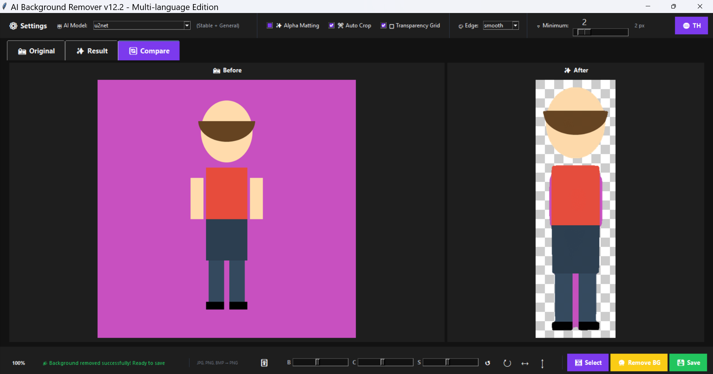

# 📋 GitHub Setup Checklist

## ก่อนอัปโหลด (Preparation)

### 1. ตรวจสอบไฟล์ ✅

```
your-project/
├── main.py ✅
├── config.py ✅
├── models.py ✅
├── utils.py ✅
├── widgets.py ✅
├── image_handler.py ✅
├── main.spec ✅
├── README.md ✅ (สร้างใหม่)
├── LICENSE ✅ (สร้างใหม่)
├── requirements.txt ✅ (สร้างใหม่)
├── CONTRIBUTING.md ✅ (สร้างใหม่)
├── CHANGELOG.md ✅ (สร้างใหม่)
├── .gitignore ✅ (สร้างใหม่)
└── docs/
    ├── th/
    │   ├── advanced_models_guide.md ✅
    │   ├── local_models_guide.md ✅
    │   ├── multilang_guide.md ✅
    │   └── portable_guide.md ✅
    └── en/
        ├── advanced_models_guide_en.md ✅
        ├── local_models_guide_en.md ✅
        ├── multilang_guide_en.md ✅
        └── portable_guide_en.md ✅
```

### 2. สร้างไฟล์พิเศษ

#### requirements.txt
```txt
rembg>=2.0.50
Pillow>=10.0.0
numpy>=1.24.0
scipy>=1.11.0
onnxruntime>=1.16.0
```

#### .gitignore
```
# Python
__pycache__/
*.py[cod]
*.egg-info/
dist/
build/

# Virtual Environment
venv/
env/

# IDEs
.vscode/
.idea/

# OS
.DS_Store

# Project
models/*.onnx
*.png
*.jpg
output/
```

---

## การอัปโหลด (Upload)

### วิธีที่ 1: GitHub Desktop (ง่ายที่สุด)

1. ⬇️ **Download GitHub Desktop**: https://desktop.github.com/
2. 🔐 **Sign in** with GitHub account
3. ➕ **File** → **New Repository**
   - Name: `ai-background-remover`
   - Description: `AI Background Remover v12.2`
   - Path: เลือก folder โปรเจค
   - Initialize: ✅ README, ✅ Git Ignore (Python), ✅ License (MIT)
4. 📝 **Commit** changes: "Initial commit v12.2"
5. 🚀 **Publish repository** → Public/Private
6. ✅ **Done!**

### วิธีที่ 2: Command Line

```bash
# 1. สร้าง repo บน GitHub.com ก่อน

# 2. Clone มา
git clone https://github.com/YOUR_USERNAME/ai-background-remover.git
cd ai-background-remover

# 3. คัดลอกไฟล์ทั้งหมดเข้ามา
cp -r /path/to/your/files/* .

# 4. Add files
git add .

# 5. Commit
git commit -m "Initial commit - AI Background Remover v12.2"

# 6. Push
git push origin main
```

---

## หลังอัปโหลด (Post-Upload)

### 1. เพิ่ม Screenshots 📸

#### ถ่ายภาพหน้าจอ
1. เปิดโปรแกรม
2. กด Windows + Shift + S (Windows) หรือ Cmd + Shift + 4 (Mac)
3. ถ่าย:
   - Main interface
   - Before/After comparison
   - Settings panel
   - Multi-language demo

#### สร้าง screenshots folder
```bash
mkdir screenshots
# วางไฟล์ภาพใน screenshots/
```

#### อัปเดต README.md
```markdown
## 📸 Screenshots

### Main Interface


### Before & After


### Settings


### Multi-language Support

```

### 2. เพิ่ม Badges 🏅

แก้ไข README.md เพิ่ม badges:

```markdown
# 🎨 AI Background Remover v12.2

[](https://www.python.org/)
[](LICENSE)
[](https://github.com/YOUR_USERNAME/ai-background-remover/stargazers)
[](https://github.com/YOUR_USERNAME/ai-background-remover/issues)
[](https://github.com/danielgatis/rembg)
```

**เปลี่ยน `YOUR_USERNAME` เป็นชื่อ GitHub ของคุณ**

### 3. ตั้งค่า Repository 🔧

#### About Section
1. ไปที่ repository page
2. คลิก ⚙️ (Settings) ที่ด้านขวาบน "About"
3. เพิ่ม:
   - **Description**: `Remove image backgrounds using AI - Multi-language (EN/TH)`
   - **Website**: (ถ้ามี)
   - **Topics**: `python`, `ai`, `background-removal`, `image-processing`, `rembg`, `tkinter`, `multilingual`

#### GitHub Pages (Optional)
1. Settings → Pages
2. Source: Deploy from a branch
3. Branch: main / docs
4. สร้าง documentation website

### 4. เปิดใช้ Issues & Discussions 💬

#### Issues
- Settings → General → Features
- ✅ Issues

#### Discussions
- Settings → General → Features  
- ✅ Discussions
- Create categories:
  - 💡 Ideas
  - 🙏 Q&A
  - 📢 Announcements
  - 🗣️ General

### 5. สร้าง Releases 🎉

#### Version 12.